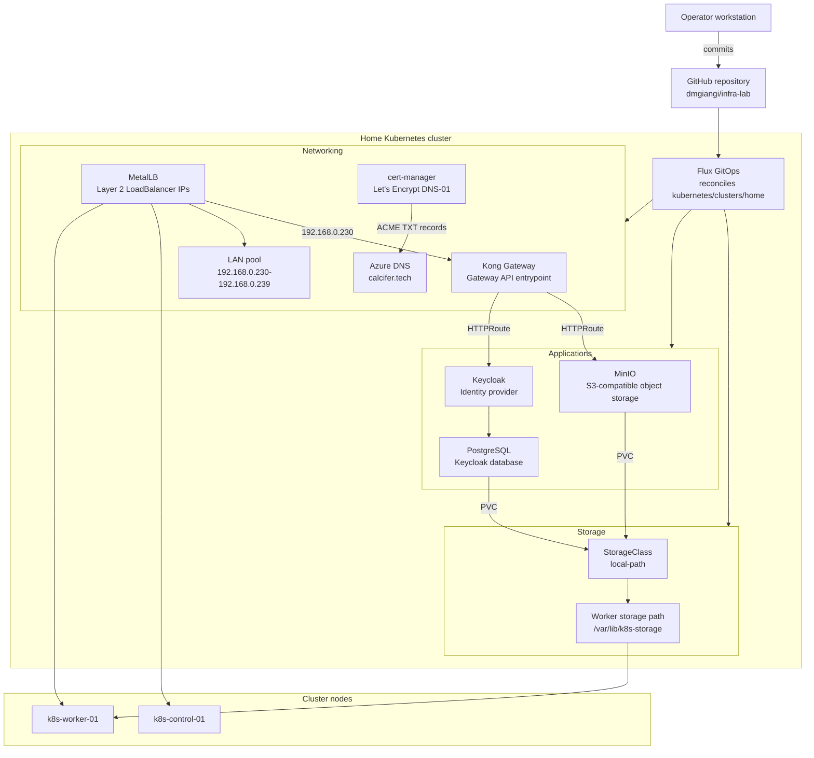

# Kubernetes

This directory contains Kubernetes resources intended to be reconciled by Flux.

## Layout

| Path | Purpose |
| --- | --- |
| `clusters/home/` | Entry point reconciled by Flux for the home cluster |
| `infrastructure/` | Cluster-wide platform resources |
| `apps/` | Application resources |

Flux is configured to reconcile:

```text
./kubernetes/clusters/home
```

## Architecture

This diagram is the source of truth for the current Kubernetes architecture. Update it when adding or removing platform components.



## Bootstrap

Flux is bootstrapped by Ansible:

```bash
cd ansible
GITHUB_TOKEN=REPLACE_WITH_TOKEN ansible-playbook playbooks/60-bootstrap-flux.yaml
```

The bootstrap uses GitHub deploy key authentication. The GitHub token is used only by the Flux CLI during bootstrap to update the repository and configure the deploy key. The cluster stores the generated SSH private key in the `flux-system` namespace.

## Apply Model

After Flux is bootstrapped, permanent Kubernetes changes should be made through Git commits under this directory instead of direct `kubectl apply`.

## Storage

The home cluster uses `local-path-provisioner` through a Flux `HelmRelease`, with this StorageClass:

```text
local-path
```

The Helm chart source is pinned to the upstream repository tag `v0.0.35`.

The provisioner stores dynamically created volumes on:

```text
k8s-worker-01:/var/lib/k8s-storage
```

The control-plane node is explicitly configured with no provisioning paths, so PVC-backed workloads should run on worker nodes.

## Networking

The home cluster uses MetalLB in Layer 2 mode for LAN `LoadBalancer` services.

The configured address pool is:

```text
192.168.0.230-192.168.0.239
```

These addresses must stay outside the router DHCP pool. MetalLB does not create Linux network interfaces for these IPs; it advertises them on the LAN with ARP from one of the Kubernetes nodes.

Kong Gateway is the HTTP/TLS entrypoint for LAN services. Its proxy service uses a fixed MetalLB address:

```text
192.168.0.230
```

Initial routes:

| Host | Upstream |
| --- | --- |
| `minio.calcifer.tech` | MinIO Console |
| `s3.calcifer.tech` | MinIO S3 API |
| `auth.calcifer.tech` | Keycloak |

Routing uses Gateway API:

```text
Gateway: ingress/kong
HTTPRoute: minio/minio-console
HTTPRoute: minio/minio-s3
HTTPRoute: identity/keycloak
```

## TLS Certificates

TLS certificates are managed by `cert-manager` through Let's Encrypt DNS-01 challenges against Azure DNS for:

```text
calcifer.tech
```

The initial certificate request is a wildcard certificate:

```text
*.calcifer.tech
```

The certificate is stored in the `ingress` namespace as:

```text
calcifer-tech-wildcard-tls
```

The Azure DNS client secret is stored in a SOPS-encrypted Secret:

```text
kubernetes/infrastructure/cert-manager/config/azuredns-credentials.enc.yaml
```

Before reconciling this configuration, replace the Azure placeholders in:

```text
kubernetes/infrastructure/cert-manager/config/letsencrypt-clusterissuers.yaml
```

The wildcard certificate uses `letsencrypt-prod`. Use `letsencrypt-staging` when testing issuer or DNS changes to avoid Let's Encrypt production rate limits.

## MinIO

MinIO is installed through the `minio` Helm chart from:

```text
https://charts.min.io/
```

The release runs in standalone mode:

```text
namespace: minio
storageClass: local-path
size: 20Gi
node: k8s-worker-01
```

Root credentials are stored in the SOPS-encrypted Secret:

```text
kubernetes/apps/minio/secrets.enc.yaml
```

To decrypt or edit it locally:

```bash
sops kubernetes/apps/minio/secrets.enc.yaml
```

## Keycloak

Keycloak is installed through the Bitnami `keycloak` Helm chart and exposed through Kong Gateway API:

```text
host: auth.calcifer.tech
namespace: identity
database: PostgreSQL
database storageClass: local-path
database size: 5Gi
node: k8s-worker-01
```

The initial admin password and PostgreSQL credentials are stored in the SOPS-encrypted Secret bundle:

```text
kubernetes/apps/identity/secrets.enc.yaml
```

To decrypt or edit it locally:

```bash
sops kubernetes/apps/identity/secrets.enc.yaml
```

Keycloak application configuration is applied by an idempotent Kubernetes Job:

```text
kubernetes/apps/identity/keycloak-config/
```

The Job uses the `master/admin` account only as a bootstrap credential, then manages the `calcifer` realm through the Keycloak Admin API.

Initial managed resources:

```text
realm: calcifer
realm roles: user, admin
groups: users, admins
local test user: dmgiangi
client: lab-console
google identity provider: enabled
```

The `admins` group receives both application roles and the `realm-management/realm-admin` client role inside the `calcifer` realm. This allows administration of the application realm without granting global access to the `master` realm.

The Google OAuth client must allow this redirect URI:

```text
https://auth.calcifer.tech/realms/calcifer/broker/google/endpoint
```

The Job name is versioned:

```text
keycloak-configure-v2
```

When the Job logic or managed configuration must be re-applied through GitOps after a completed run, bump the Job name, for example to `keycloak-configure-v3`.
Completed Jobs are intentionally kept in the cluster so Flux does not recreate them on every reconciliation.
